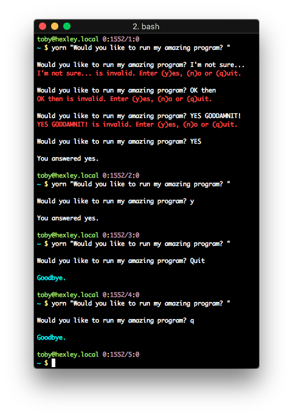

# GET A BINARY RESPONSE TO A QUESTION

A very boring input reading package/library. Takes a question string as an
argument and returns true if y or yes is entered, false if n or no is entered,
quits if q or quit is entered, and asks again if anything else is entered.

*Entered characters are case insensitive, but you must enter the correct
spelling or the first character of the word.*

I find this useful for getting user input in a script and got tired of
re-writing it in every program so decided to create a package for it.

## INSTALLATION

`pip install yorn`

## CLI USAGE

```
usage: yorn [-h] question

Answer yes or no to a question.

positional arguments:
  question    A question to ask.

optional arguments:
  -h, --help  show this help message and exit
```



## PYTHON USAGE

```python
from yorn import ask

question = "Would you like run my amazing program? "

if ask(question):
	run_my_amazing_function()
else
	print("Cookie monster is sad :-(")
```
